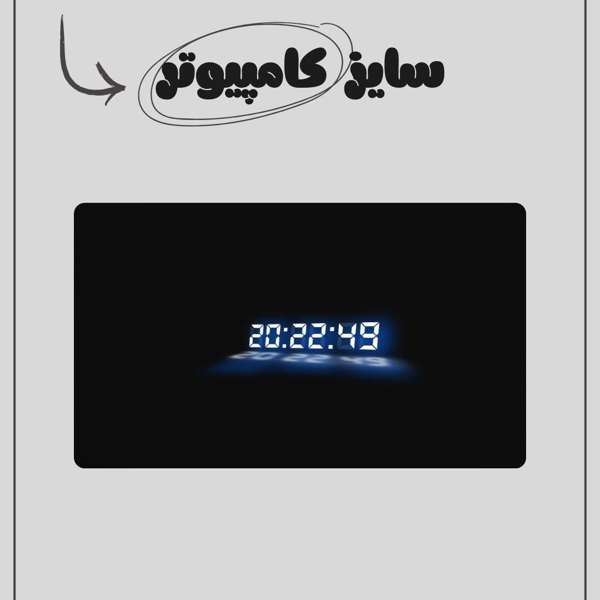

# ⏰ 3D Clock – Real-Time Web App (JavaScript + Tailwind CSS)

A modern and interactive **3D Clock** built with **JavaScript** and **Tailwind CSS**.  
This project displays the current time in a **real-time animated 3D design**, providing a smooth and visually engaging user experience.

---

## 📅 Project Date  
**August 19, 2025**

## 🔗 Live Demo  
[View Live Demo](https://parsa-farshah.github.io/clock3D/)

---

## ✨ Features  

- 🕒 **Real-Time Clock** – always up-to-date with the current time  
- 🎨 **3D Design** – interactive clock face with modern UI  
- ⚡ **Lightweight & Fast** – pure JavaScript + Tailwind, no heavy frameworks  
- 📱 **Fully Responsive** – optimized for desktop, tablet, and mobile  
- 🔄 **Cross-Browser Compatible** – works smoothly across all major browsers  

---

## 🛠️ Tech Stack  

- **HTML5** – semantic and accessible structure  
- **CSS3 + Tailwind CSS** – responsive design with utility-first styling  
- **JavaScript (ES6+)** – real-time functionality and interactivity  

---

## 👨‍💻 Developed By  
**Parsa Dehghan Pour Farashah**

## 🔧 Project Mentor  
[@parsa_ghorbanian_web](https://www.instagram.com/parsa_ghorbanian_web)

---

## 📲 Connect with Me  

- 📸 Instagram: [@parsa_dehghanpour_dv](https://www.instagram.com/parsa_dehghanpour_dv)  
- 💼 LinkedIn: [Parsa Dehghan Pour Farashah](https://linkedin.com/in/parsa-dehghan-pour-farashah-85ab04250)  
- 💻 GitHub: [parsa-farshah](https://github.com/parsa-farshah)  
- 📩 Email: parsafarashah2002@gmail.com  
- 📺 YouTube: [@FrontEndFresh](https://youtube.com/@FrontEndFresh)  

---

## 📸 Project Screenshot  

### 🖥️ Desktop View  

### 📱 Tablet View  

### 📱 Mobile View  

